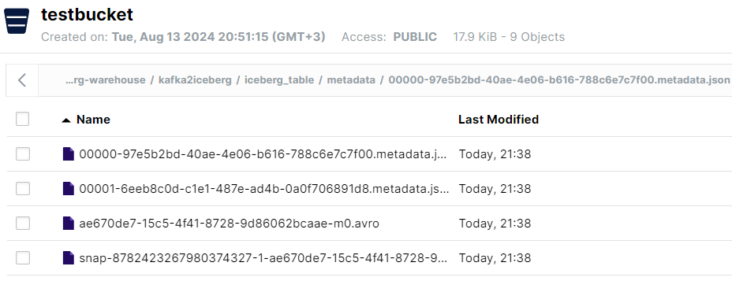

# Iceberg Applications

A collection of out-of-the-box Spring Boot based Apache Spark applications that perform common tasks regarding Apache Iceberg. 
Currently, the existing applications are:
* `kafka2iceberg` - A pipeline that reads data from Kafka and writes to Iceberg.
* `iceberg-maintainer` - A program that executes Iceberg maintenance tasks.

## Local Usage & Development,

### Step 1: Run the environment Docker Compose file, and another Docker Compose for the catalog 
The local usage & development of `iceberg-application` requires to set up containers using docker compose.
For the general environment it is required to set up `environment/compose/environment-docker-compose.yaml`.
This will bring up Minio S3, Kafka & Zookeeper (with Kafka UI).
Based on how we would like to configure Iceberg's catalog, we should also bring up `environment/compose/{nessie/postgres}-docker-compose.yaml`.
Or in case of using S3 based catalog (e.g. Hadoop catalog), we don't need any other container.

Each application needs to be configured in the Spring `application.yaml` by `spring.iceberg.catalog-type={hadoop/hive/jdbc}` to choose the catalog type.

### Step 2: Execute the [DevSamplePojoKafkaProducer.java](kafka2iceberg%2Fsrc%2Fmain%2Fjava%2Fio%2Fgithub%2Falmogtavor%2FDevSamplePojoKafkaProducer.java) Script to produce to Kafka

### Step 3: Execute the Kafka2Iceberg

To execute the Kafka2Iceberg service, you should first of all download [Hadoop Binaries](https://github.com/steveloughran/winutils/tree/master/hadoop-2.7.1/bin),
and put them locally at `C:/hadoop`.
You should have the hadoop binaries at the location of `C:/hadoop/hadoop-2.7.1`.
At the IntelliJ run configurations, configure 2 environment variables:
`HADOOP_HOME=C:\hadoop\hadoop-2.7.1;PATH=C:\hadoop\hadoop-2.7.1\bin`.

Set the Spring Boot profile to `jdbc` or `nessie`.

And set the VM options to: `--add-opens=java.base/sun.nio.ch=ALL-UNNAMED --add-opens=java.base/sun.nio.cs=ALL-UNNAMED --enable-preview`.

### Step 4: View your Iceberg Table at the Minio console

Enter `locahost:9001`, and checkout your bucket to verify the Kafka2Iceberg have successfully created an Iceberg table:

### Step 5: Run the Iceberg Maintainer at the same way you run Kafka2Iceberg

After the files merges happens, checkout your Minio bucket again and see what's changes.